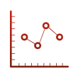

# RedisTimeSeries Module

Time series data structure for Redis.

## Memory model

A time series is a linked list of memory chunks.
Each chunk has a predefined size of samples.
Each sample is a tuple of the time and the value of 128 bits,
64 bits for the timestamp and 64 bits for the value.

## Features

- Quick inserts (50K samples per sec)
- Query by start time and end-time
- Aggregated queries (Min, Max, Avg, Sum, Range, Count, First, Last) for any time bucket
- Configurable max retention period
- Compactions/Roll-ups - automatically updated aggregated timeseries

## Setup

You can either get RedisTimeSeries setup in a Docker container or on your own machine.

### Run in a Docker container

To quickly setup RedisTimeSeries, launch an instance using docker:

```sh
docker run -p 6379:6379 -it --rm redislabs/redistimeseries
```

### Build and Run it yourself

You can also build and run RedisTimeSeries on your own machine.

#### Build

To build RedisTimeSeries:

```bash
git submodule init
git submodule update
cd src
make all
```

#### Run

In your redis-server run: `loadmodule redistimeseries.so`

For more infomation about modules, go to the [redis offical documentation](https://redis.io/topics/modules-intro).

## Give it a try

After you setup RedisTimeSeries, you can interact with it using redis-cli.

Here we'll create a time series representing sensor temperature measurements. 
After you create the time series, you can send temperature measurements.
Then you can query the data for a time range on some aggreagation rule.

### With `redis-cli`

```sh
$ redis-cli
127.0.0.1:6379> TS.CREATE temperature RETENTION 60 LABELS sensor_id 2 area_id 32
OK
127.0.0.1:6379> TS.ADD temperature:3:11 1548149181 30
OK
127.0.0.1:6379> TS.ADD temperature:3:11 1548149191 42
OK
127.0.0.1:6379>  TS.RANGE temperature:3:11 1548149180 1548149210 AGGREGATION avg 5
1) 1) (integer) 1548149180
   2) "30"
2) 1) (integer) 1548149190
   2) "42"
```

### Tests

Tests are written in python using the [rmtest](https://github.com/RedisLabs/rmtest) library.

```
$ cd src
$ pip install -r tests/requirements.txt # optional, use virtualenv
$ make test
```

### Client libraries

Some languages have client libraries that provide support for RedisTimeSeries commands:

| Project | Language | License | Author | URL |
| ------- | -------- | ------- | ------ | --- |
| JRedisTimeSeries | Java | BSD-3 | [RedisLabs](https://redislabs.com/) | [Github](https://github.com/RedisTimeSeries/JRedisTimeSeries/) |
| redistimeseries-go | Go | Apache-2 | [RedisLabs](https://redislabs.com/) | [Github](https://github.com/RedisTimeSeries/redistimeseries-go) |

## Using RedisTimeSeries with other metrics tools

In the [RedisTimeSeries](https://github.com/RedisTimeSeries) organization you can
find projects that help you integrate RedisTimeSeries with other tools, including:

- StatsD - Graphite exports using graphite protocol
- Grafana - using SimpleJson datasource
